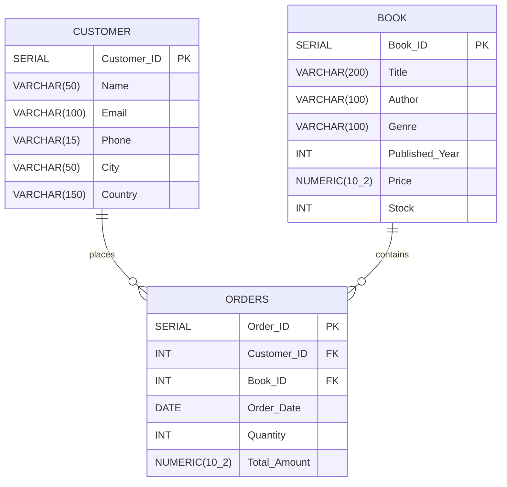

# 📚 Online Bookstore Insights — SQL Data Analysis

[](https://www.postgresql.org/)
[](#business-problems--sql-solutions)
[](#license)

An end-to-end relational database and SQL analytics project designed to extract actionable business intelligence from an e-commerce online bookstore. This project demonstrates database schema design, normalization, data ingestion from CSV files, and answering core and advanced business questions using SQL.

---

## 📌 Table of Contents

- [Project Overview](#-project-overview)
- [Repository Structure](#-repository-structure)
- [Database Schema & ER Diagram](#-database-schema--er-diagram)
- [Datasets Description](#-datasets-description)
- [Installation & Setup](#-installation--setup)
- [Business Problems & SQL Solutions](#-business-problems--sql-solutions)
  - [Basic Level Queries](#1-basic-level-queries)
  - [Advanced Level Queries](#2-advanced-level-queries)
- [Key Business Takeaways](#-key-business-takeaways)
- [Future Enhancements](#-future-enhancements)
- [Author](#-author)

---

## 📖 Project Overview

Online retailers generate substantial transaction and customer interaction data daily. Understanding purchasing trends, inventory health, and customer geographic distribution is vital for strategic decision-making.

This project models an **Online Bookstore (`OnlineBookstore`)** database to analyze:
- **Sales Performance**: Total revenue, high-value transactions, order distributions over time.
- **Inventory Health**: Stock levels across genres, most/least stocked books, pricing dynamics.
- **Customer Behavior**: Multi-order frequency, country-specific client bases, order volume.
- **Genre Insights**: Bestselling and high-demand genres, average pricing per category.

---

## 📂 Repository Structure

```plaintext
sql-bookstore-insights/
├── BOOK.csv                     # Raw book inventory dataset (500 records)
├── CUSTOMER.csv                 # Customer profiles dataset (500 records)
├── ORDERS.csv                   # Historical transaction orders dataset (500 records)
├── Book_sell_customer_orders.sql# Database DDL, schema alteration, and analytical queries
└── README.md                    # Project documentation & query guide
```

---

## 🗄️ Database Schema & ER Diagram

The database structure consists of three normalized tables interconnected via primary and foreign key constraints:



---

## 📊 Datasets Description

| File | Records | Key Attributes | Description |
| :--- | :--- | :--- | :--- |
| **`BOOK.csv`** | 500 | `Book_ID`, `Title`, `Author`, `Genre`, `Published_Year`, `Price`, `Stock` | Contains catalog details, publication years, pricing, and current stock. |
| **`CUSTOMER.csv`** | 500 | `Customer_ID`, `Name`, `Email`, `Phone`, `City`, `Country` | Customer demographics and contact records across multiple countries. |
| **`ORDERS.csv`** | 500 | `Order_ID`, `Customer_ID`, `Book_ID`, `Order_Date`, `Quantity`, `Total_Amount` | Transaction histories including quantities purchased, purchase date, and total amount. |

---

## 🚀 Installation & Setup

### 1. Prerequisites
- **PostgreSQL** (version 12 or newer recommended) or any ANSI-compatible relational database engine.
- A database client such as **pgAdmin**, **DBeaver**, or the `psql` command-line utility.

### 2. Create Database & Tables
Execute the initial DDL script from [Book_sell_customer_orders.sql](file:///c:/Users/aakas/OneDrive/Desktop/My%20Work/sql%20project/sql-bookstore-insights/Book_sell_customer_orders.sql):

```sql
-- Create database
CREATE DATABASE OnlineBookstore;

-- Connect to OnlineBookstore, then execute table creation:
DROP TABLE IF EXISTS Orders;
DROP TABLE IF EXISTS Customer;
DROP TABLE IF EXISTS Book;

CREATE TABLE Book(
    Book_ID SERIAL PRIMARY KEY,
    Title VARCHAR(200),
    Author VARCHAR(100),
    Genre VARCHAR(100),
    Published_Year INT,
    Price NUMERIC(10,2),
    Stock INT
);

CREATE TABLE Customer(
    Customer_ID SERIAL PRIMARY KEY,
    Name VARCHAR(50),
    Email VARCHAR(100),
    Phone VARCHAR(15),
    City VARCHAR(50),
    Country VARCHAR(150)
);

CREATE TABLE Orders(
    Order_ID SERIAL PRIMARY KEY,
    Customer_ID INT REFERENCES Customer(Customer_ID),
    Book_ID INT REFERENCES Book(Book_ID),
    Order_Date DATE,
    Quantity INT,
    Total_Amount NUMERIC(10,2)
);
```

### 3. Load Data from CSV
If using PostgreSQL `psql`, import the CSV datasets into your tables:

```sql
\copy Book(Book_ID, Title, Author, Genre, Published_Year, Price, Stock) FROM 'path/to/BOOK.csv' WITH (FORMAT csv, HEADER true);
\copy Customer(Customer_ID, Name, Email, Phone, City, Country) FROM 'path/to/CUSTOMER.csv' WITH (FORMAT csv, HEADER true);
\copy Orders(Order_ID, Customer_ID, Book_ID, Order_Date, Quantity, Total_Amount) FROM 'path/to/ORDERS.csv' WITH (FORMAT csv, HEADER true);
```

---

## 💡 Business Problems & SQL Solutions

### 1. Basic Level Queries

#### Q1: Retrieve all books in the "Fiction" genre
```sql
SELECT * FROM Book
WHERE Genre = 'Fiction';
```

#### Q2: Find books published after the year 1950
```sql
SELECT * FROM Book
WHERE Published_Year > 1950
ORDER BY Published_Year;
```

#### Q3: List all customers from Canada
```sql
SELECT * FROM Customer 
WHERE Country = 'Canada';
```

#### Q4: Show orders placed in November 2023
```sql
SELECT * FROM Orders
WHERE Order_Date BETWEEN '2023-11-01' AND '2023-11-30';
```

#### Q5: Retrieve the total stock of books available
```sql
SELECT SUM(Stock) AS Total_Stock
FROM Book;
```

#### Q6: Find the details of the most expensive book
```sql
SELECT * FROM Book
ORDER BY Price DESC 
LIMIT 1;
```

#### Q7: Show all customers who ordered more than 1 quantity of a book
```sql
SELECT DISTINCT c.Customer_ID, c.Name, c.Email, o.Quantity
FROM Customer c
JOIN Orders o ON c.Customer_ID = o.Customer_ID
WHERE o.Quantity > 1;
```

#### Q8: Retrieve all orders where the total amount exceeds $20
```sql
SELECT * FROM Orders
WHERE Total_Amount > 20;
```

#### Q9: List all unique genres available in the catalog
```sql
SELECT DISTINCT Genre 
FROM Book;
```

#### Q10: Find the book with the lowest stock level
```sql
SELECT * FROM Book
ORDER BY Stock ASC 
LIMIT 1;
```

#### Q11: Calculate the total revenue generated from all orders
```sql
SELECT SUM(Total_Amount) AS Revenue 
FROM Orders;
```

---

### 2. Advanced Level Queries

#### Q1: Retrieve the total number of books sold for each genre
```sql
SELECT b.Genre, SUM(o.Quantity) AS Total_Books_Sold
FROM Orders o
JOIN Book b ON o.Book_ID = b.Book_ID
GROUP BY b.Genre
ORDER BY Total_Books_Sold DESC;
```

#### Q2: Find the average price of books in the "Fantasy" genre
```sql
SELECT ROUND(AVG(Price), 2) AS Average_Price 
FROM Book
WHERE Genre = 'Fantasy';
```

#### Q3: List customers who have placed at least 2 orders
```sql
SELECT c.Customer_ID, c.Name, COUNT(o.Order_ID) AS Order_Count
FROM Customer c
JOIN Orders o ON c.Customer_ID = o.Customer_ID
GROUP BY c.Customer_ID, c.Name
HAVING COUNT(o.Order_ID) >= 2
ORDER BY Order_Count DESC;
```

#### Q4: Find the most frequently ordered book
```sql
SELECT b.Book_ID, b.Title, b.Author, COUNT(o.Order_ID) AS Times_Ordered, SUM(o.Quantity) AS Total_Units_Sold
FROM Orders o
JOIN Book b ON o.Book_ID = b.Book_ID
GROUP BY b.Book_ID, b.Title, b.Author
ORDER BY Times_Ordered DESC
LIMIT 1;
```

#### Q5: Identify top 3 revenue-generating customers
```sql
SELECT c.Customer_ID, c.Name, SUM(o.Total_Amount) AS Total_Spent
FROM Customer c
JOIN Orders o ON c.Customer_ID = o.Customer_ID
GROUP BY c.Customer_ID, c.Name
ORDER BY Total_Spent DESC
LIMIT 3;
```

---

## 📈 Key Business Takeaways

1. **Inventory Management**: Identification of items with critical stock depletion ensures timely reordering, avoiding stockouts.
2. **Genre Demand Analysis**: Aggregating units sold by genre reveals which categories drive the highest unit volume, guiding procurement budgets.
3. **Customer Loyalty**: Identifying repeat buyers (customers with $\ge 2$ orders) allows the marketing team to build personalized retention and reward campaigns.
4. **Order Basket Size**: Identifying orders exceeding specific threshold values highlights customer willingness to make bulk purchases.

---

## 🔮 Future Enhancements

- [ ] Build analytical views and window functions for **Monthly Recurring Revenue (MRR)** and running totals.
- [ ] Implement database indexes on `Orders(Customer_ID)`, `Orders(Book_ID)`, and `Orders(Order_Date)` to optimize query execution on large datasets.
- [ ] Connect the PostgreSQL database to **Power BI** or **Metabase** to build interactive real-time executive dashboards.

---

## 👤 Author

- **GitHub**: [@aakashkumar99347578-alt](https://github.com/aakashkumar99347578-alt)
- **Project Repository**: [sql-bookstore-insights](https://github.com/aakashkumar99347578-alt/sql-bookstore-insights)

---

## 📄 License

This project is licensed under the [MIT License](https://opensource.org/licenses/MIT).
